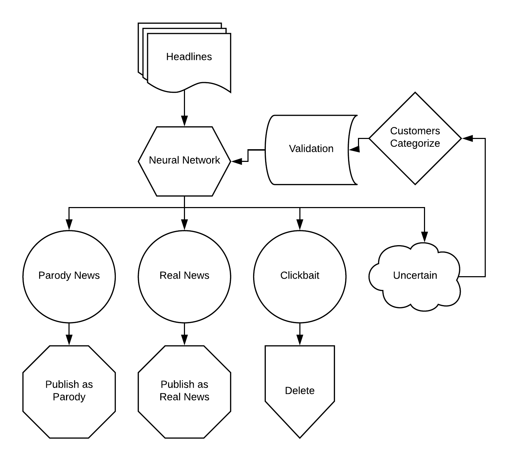

# Categorizing News Headlines with Deep Learning
Separating parody and clickbait from real news using a Convolutional Neural Network

# Motivation

When you have a service that is built around curating online content, it’s mission critical to make sure that you’re delivering your customers high quality content that is portrayed accurately.

Unfortunately, it can be hard to know what’s real. With such low barriers to online publishing, anything can end up online, and even professional journalists and politicians can be fooled. With many thousands of articles coming out every day, it’s a huge job to sort them out for your customers, and errors can have serious consequences.

In approaching this problem, I've found it useful to think of news articles not just as real versus fake, but as real, parody, or clickbait. This is because these are all written in distinct styles. Parody news is meant to mimic the style of real news, but generally aims to entertain rather than deceive. Meanwhile, clickbait can be filled with complete nonsense, and will meld itself into whatever format is most attention-grabbing.

# Results

Training a Convolutional Neural Network on a database of 35,000 labelled headlines resulted in a classification accuracy of ~80%, a result that would have been state-of-the-art even a few years ago.

In addition to the modelling that is core to this project, I prepared a chart suggesting a plan for productization and implementation of the neural network.

# Notebooks of Interest

[Complete Project Notebook](notebooks/ModFourProject.ipynb)

# Figures of Interest

## Usage
On a daily basis, the neural network will be able to sort headlines into real news, parody news, clickbait, and news it’s not quite sure about.

Real news and parody news can go into the pipeline for publishing, appropriately labeled as what they are so that nobody thinks fish have taken over the government. Clickbait gets discarded, just as it should be. Finally, the uncertain headlines can be categorized by crowdsourcing to the public, just like companies like Google, Facebook, and OkCupid routinely do. After validation to make sure that the model improves, these get fed back to the neural network, making it even more accurate every single day.
